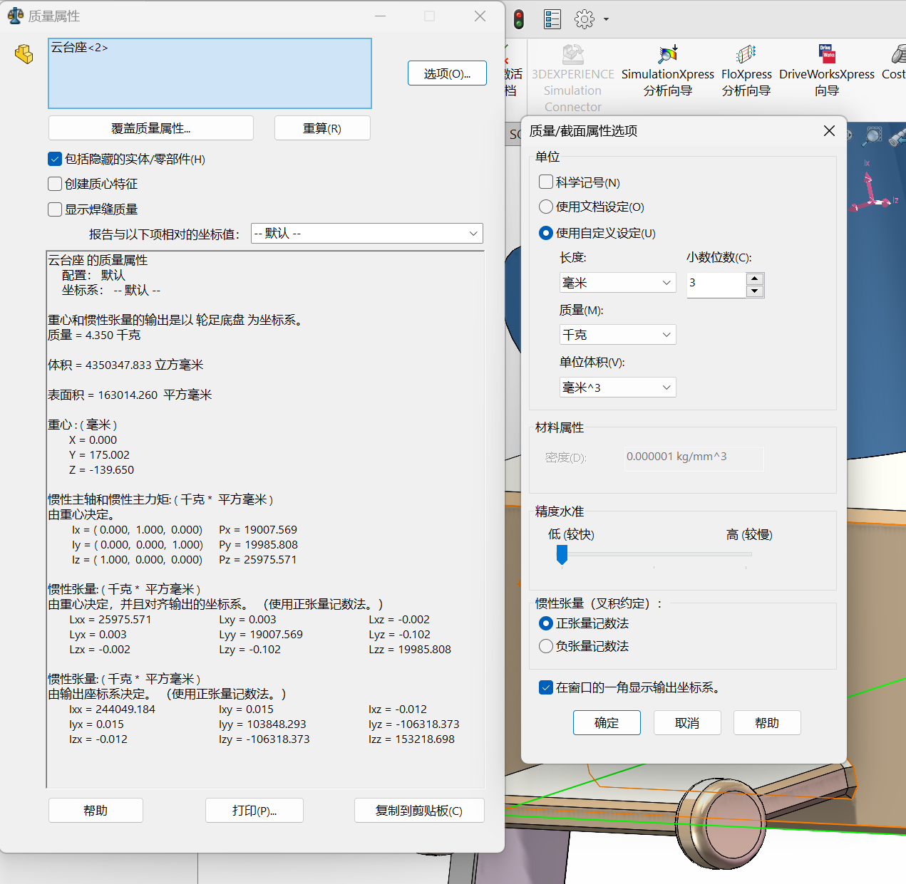

# 轮足参数

机体部分，选取关节对角连线交点为坐标系
底盘部分重心位置[0,0,-1.459] (mm)，质量18.919kg
惯性张量矩阵[418685.411,0,0;0,195009.101,1950.929;0,1950.929,293941.515]

对于云台部分，选取关节对角线交点为基坐标系
云台部分重心位置[10.35,0,175.002]，质量4.35kg
惯性张量矩阵
[19007.569,-0.102,0.003;-0.102,19985.808,-0.002;0.003,-0.002,25975.571]

计算上述组合重心位置为[1.93487,0,31.52933]，总质量23.269kg

在该重心处设置参考坐标系直接导出惯性张量

大腿长150mm，质量0.189kg，惯性张量465.732kg/mm^2
重心四个位置，y=±250，y=±230

小腿长288mm，质量0.327kg，惯性张量2350.113kg/mm^2
重心四个位置，y=±250，y=±230

轮子半径70mm，质量0.308kg，惯性张量387.411kg/mm^2
位置y=±270
